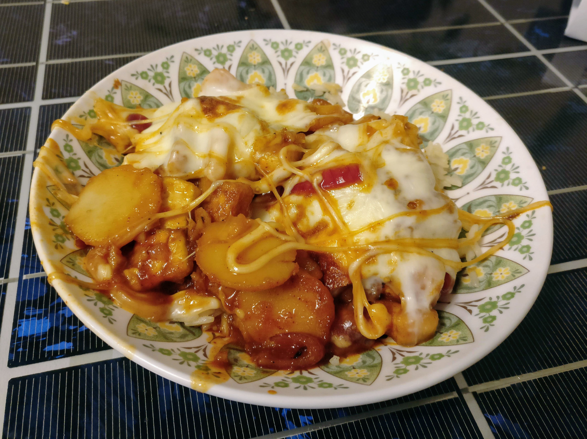

# Cheese Bul Dubu

## Ingredients

- 1 Package extra firm tofu
- 1 cup Jasmine rice
- 1.5 cup Vegetable broth
- 3 tablespoons corn starch
- 1 Medium red onion, diced
- 1 habanero pepper, roasted and diced
- 10 garlic cloves, diced
- 3 tablespoons ginger, half pureed half diced
- 16oz mozzarella, sliced
- 1 green onion
- 2 8oz cans sliced water chest nuts
- 1/3 Cup Go Chu Jang (hot pepper paste)
- 2 tablespoons honey
- 3 tablespoons Unsalted Butter
- 3 tablespoons Sesame oil
- 1 tablespoon Soy sauce
- 2 teaspoons rice vinegar 
- black pepper and salt to taste

## Directions

1. Cut tofu block in half lengthwise. Place between two plates and place a number of heavy cans/jars on top. Squeeze tofu for 20-30 minutes and drain excess moisture as necessary.

2. Bring vegetable broth to a boil. Add rice and cook until soft and all the moisture is absorbed. (add a bit of extra broth/water if needed). When rice is done remove from heat and add a tablespoon of butter.

3. While waiting for rice and tofu prep habanero, onion, garlic and ginger

4. preheat oven to 350°

5. Once tofu is drained. Dice and place in medium mixing bowl. Lightly coat with soy sauce. Then hand mix while sprinkling cornstarch.

6. Bring pan to a medium high heat. Add remaining butter and tofu to the pan. Brown on each side and add sesame oil while cooking as needed. Remove Tofu and place on wire rack to dry.

7. Deglaze pan with rice vinegar. Fry garlic and the diced ginger in butter for 5 to 8 minutes on medium to low heat. Turn up heat slightly and cook onion until it starts to turn translucent. Add sesame oil as needed.

8. Add habanero, water chestnuts, ginger paste, honey and Go Chu Jang to pan. Simmer for a few minutes while tasting and adjusting accordingly. Season with salt and pepper.

9. Line an oven proof dish with dried tofu. Pour contents of pan on top and spread evenly. Top with the slices of mozzarella. Cook in oven until cheese in melted

10. Turn oven to broil and brown the cheese

11. Plate the dish and top with green onions
